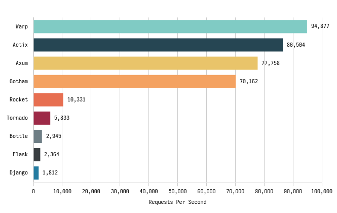
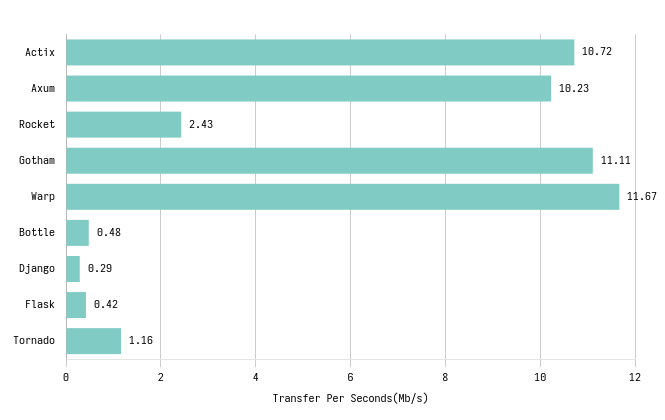

# Chose your backend carefully

# Read @criterion, then @result, then @so.
There is nothing particularly interesting inside the directories.
Plain code to display "Hello, World" in different popular frameworks.

